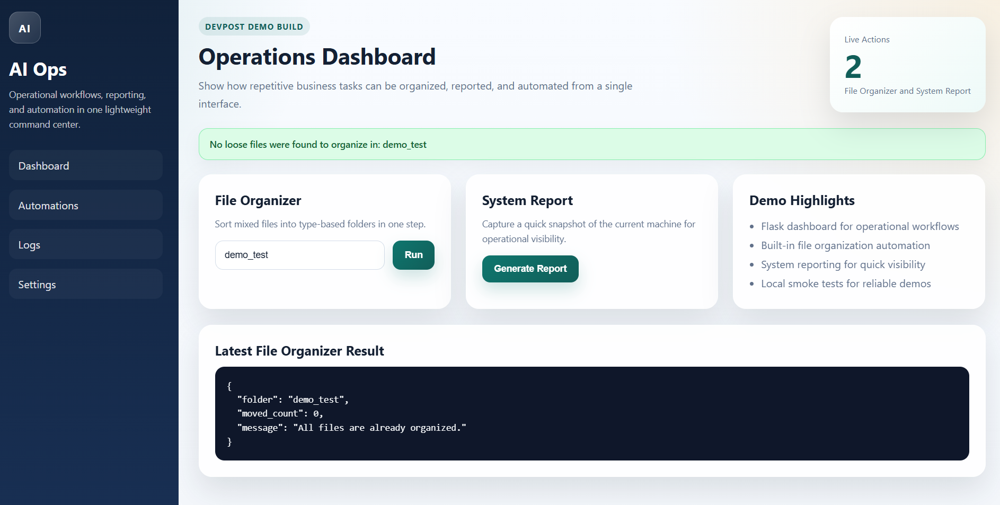

# Why Building AI Systems Gets Harder (And That’s a Good Thing)

**Author:** Brandi Kitchens  
**Date:** 2026-03-18  
**Category:** AI Engineering, Systems Design  

---

## 🧠 Introduction

When I first started building AI systems, I thought the hardest part would be understanding the models.

It wasn’t.

The real challenge starts when you move beyond tutorials and try to build something that actually works end-to-end.

My RAG system was a big milestone for me. It taught me how to connect data, embeddings, and retrieval into something useful. But this project — my AI Ops Assistant — pushed me in a completely different way.

This wasn’t just about “getting an answer from an LLM.”

This was about building a system.

A real one.

---

## 🔄 The Shift from AI Features to AI Systems

With RAG, the focus is mostly on:

- Data retrieval  
- Embeddings  
- Query pipelines  

But with this project, I had to think about:

- User interaction  
- Automation workflows  
- Backend logic  
- Deployment  
- System reliability  

That’s a completely different level of engineering.

You’re no longer just asking:

> “Does the AI work?”

You’re asking:

> “Does the system work — every time?”

---

## ⚙️ Where It Got Difficult

The hardest parts weren’t the obvious ones.

It wasn’t writing the functions.

It was:

- Getting everything to connect properly  
- Handling edge cases  
- Keeping UI and backend in sync  
- Debugging deployment issues  

Deployment alone forced me to deal with:

- Dependency conflicts  
- Environment differences  
- Build failures  

That’s when it clicked:

> Building AI is not just about intelligence — it’s about infrastructure.

---

## 💡 What I Learned

This project taught me:

- AI systems are 80% engineering, 20% AI  
- Clean structure matters more than clever code  
- Simplicity beats overengineering  
- Persistence is a real technical skill  

---

## 🚀 Final Thought

If your projects are getting harder, that’s not a bad sign.

It means you’re leveling up.

You’re moving from:

> “I can build features”

to:

> “I can build systems”

And that’s where real opportunities start.